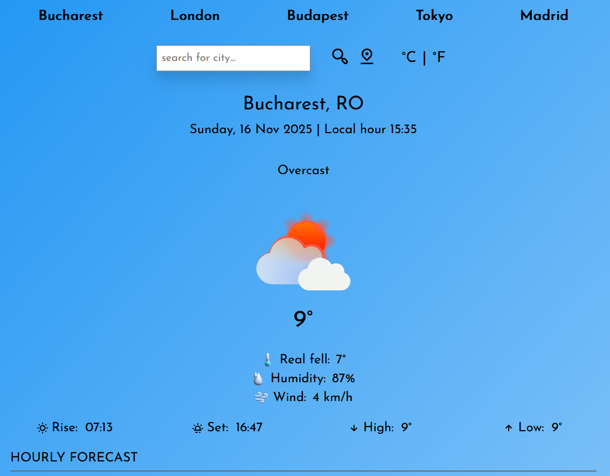

# Buddy-Weather

A modern weather app to check current conditions and forecasts for the next 24 hours or 7 days.

## 🧭 Overview

Buddy-Weather is a clean and modular frontend application built with React / Vite that allows users to view weather information for their location or entered city. It supports current day weather and extended views (hourly or 7-day forecast).  
Style and structure were given special attention through SCSS modules, and date/time formatting is handled with the Luxon library.

## 📌 Features

-   Current weather overview (temperature, conditions, etc)
-   Hourly forecast (next 24 hours) or 7-day forecast
-   Dynamic weather icons/images mapped to weather codes
-   Modular component structure:
    -   `form/` folder → input components (city search, location)
    -   `ui/` folder → display components (weather cards, lists)
-   SCSS modules for styling each component (clean separation)
-   Uses Luxon for date/time format conversions (from timestamps/ISO)
-   Deployment script included for GitHub Pages:
    -   `deploy.sh`
    -   `package.json` script: `"deploy": "gh-pages -d dist"`

## 📁 Project Structure

/public → static assets (weather icons/images)
/src
/components
/form → input/search related components
/ui → display components (weather cards, forecasts)
/data → helper logic for API data processing
/utils → utility functions (formatting, conversions)
variables.scss → global SCSS variables
global.scss → global styling (app wrapper)
vite.config.js → Vite configuration

## 🚀 Getting Started

### 1. Clone the repo

```sh
git clone https://github.com/bogdan-muntean/buddy-weather.git
cd buddy-weather
```

### 2. Install dependencies

```sh
npm install
```

### 3. Start development server

```sh
npm run dev
```

Navigate to http://localhost:5173 (or port shown in console).

### 4. Build & Deploy

```sh
npm run build
npm run deploy
```

This will create a production build (dist/) and deploy it (e.g., to GitHub Pages) via deploy.sh.

## 🛠️ Technologies Used

-React.js
-Vite
-SCSS / CSS Modules
-Luxon (for date/time formatting)
-GitHub Pages (for deployment)
-JavaScript (ES6+)

## 📷 Screenshots

The image below shows the first section of the application:


